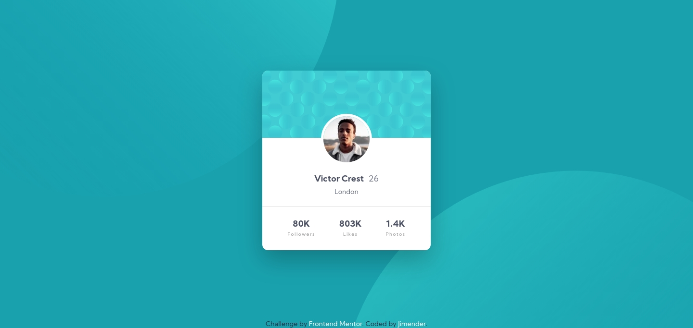

# Frontend Mentor - Profile card component solution

This is a solution to the [Profile card component challenge on Frontend Mentor](https://www.frontendmentor.io/challenges/profile-card-component-cfArpWshJ). Frontend Mentor challenges help you improve your coding skills by building realistic projects.

## Table of contents

- [Overview](#overview)
  - [The challenge](#the-challenge)
  - [Screenshot](#screenshot)
  - [Links](#links)
- [My process](#my-process)
  - [Built with](#built-with)
  - [What I learned](#what-i-learned)
  - [Continued development](#continued-development)
  - [Useful resources](#useful-resources)
- [Author](#author)
- [Acknowledgments](#acknowledgments)

## Overview

### The challenge

- Build out the project to the designs provided

### Screenshot

### Links

- Solution URL: [Code](https://github.com/Jimender/profile-card)
- Live Site URL: [Live](https://jimender.github.io/profile-card/)

## My process

### Built with

- Semantic HTML5 markup
- SASS
- Flexbox
- Mobile-first workflow

### What I learned

Gained some basic knowledge of svg and its usability.

### Continued development

### Useful resources

- [svg scaling](https://developer.mozilla.org/en-US/docs/Web/CSS/Scaling_of_SVG_backgrounds) - This helped me in svg scaling.

## Author

- Frontend Mentor - [@Jimender](https://www.frontendmentor.io/profile/Jimender)

**Note: Delete this note and add/remove/edit lines above based on what links you'd like to share.**

## Acknowledgments

Thanks to [@palgramming](https://www.frontendmentor.io/profile/palgramming) for background svg.
